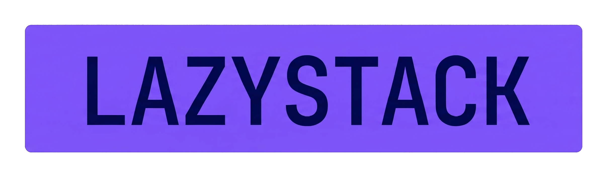
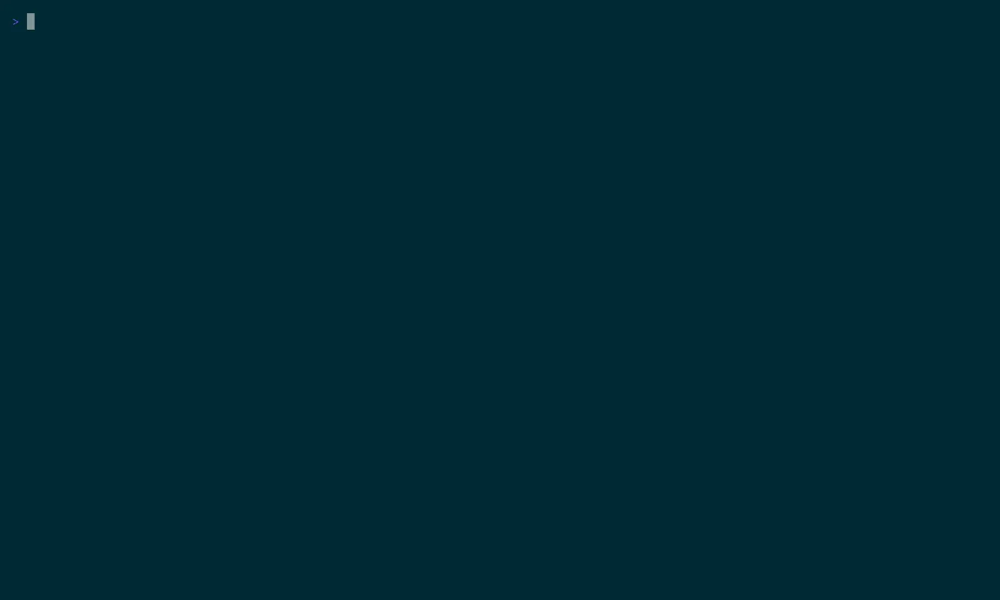

<p align="center">
  
</p>

<p align="center">
  A keyboard-driven terminal UI for OpenStack.
</p>

<p align="center">
  <a href="#installation">Installation</a> &middot;
  <a href="#features">Features</a> &middot;
  <a href="#keybindings">Keybindings</a> &middot;
  <a href="#configuration">Configuration</a> &middot;
  <a href="#license">License</a>
</p>

---

<p align="center">
  
</p>

**lazystack** is a fast, keyboard-first TUI for managing OpenStack resources from the terminal. It follows the "lazy" convention ([lazygit](https://github.com/jesseduffield/lazygit), [lazydocker](https://github.com/jesseduffield/lazydocker)) to provide an intuitive alternative to Horizon and the verbose OpenStack CLI.

Single binary. No runtime dependencies. Reads your standard `clouds.yaml`.

## Features

- **Server management** — list, create, delete, rename, rebuild, reboot, stop/start, pause, suspend, shelve, lock/unlock, rescue/unrescue, resize, snapshot, with bulk operations
- **Volume management** — list, detail, create, delete, attach (server picker), detach
- **Floating IPs** — allocate, associate, disassociate, release
- **Security groups** — create/delete groups, create/delete rules, expandable rule view
- **Networks** — create/delete networks, create/delete subnets, read-only port listing
- **Routers** — create/delete routers, add/remove interfaces (subnet picker), detail with routes
- **Key pairs** — create (RSA 2048/4096, ED25519), import with ~/.ssh/ file browser, detail view, save private key to file
- **Images** — list, detail, delete, deactivate/reactivate with status-aware coloring
- **Load balancers** (Octavia) — list, detail tree (listeners/pools/members), cascade delete
- **Project switching** — switch between accessible Keystone projects without restarting
- **Quota overlay** — compute, network, and storage quotas with color-coded progress bars
- **Confirmation dialogs** — all server state-change actions require explicit confirmation
- **Dynamic tabs** — tabs appear based on available services (no Cinder? no Volumes tab)
- **Auto-refresh** — all views refresh in the background at a configurable interval
- **SSH integration** — launch SSH sessions directly from the TUI, or copy the SSH command to clipboard
- **Console access** — retrieve noVNC console URL, open in browser or copy to clipboard
- **Server cloning** — clone servers with one keypress
- **Cross-resource navigation** — jump from server detail to attached volumes, security groups, or networks
- **Console log** and **action history** per server
- **Column sorting** on all list views
- **Client-side filtering** with `/`
- **Bulk select** with `space` for multi-server operations
- **Self-update** — `--update` flag to update to the latest release; the download must match the release's `SHA256SUMS`, which must be signed with the project's release key from v0.20.0 on; older releases fall back to the checksum alone with a warning (see [SECURITY.md](SECURITY.md#release-signing-and-self-update-verification))
- **Solarized Dark** color scheme with status-aware coloring

## Installation

### Homebrew (macOS & Linux)

```bash
brew install larkly/tap/lazystack
```

### Arch Linux (AUR)

```bash
yay -S lazystack
```

### Debian / Ubuntu

Download the `.deb` from the [releases page](https://github.com/larkly/lazystack/releases/latest) and install:

```bash
sudo dpkg -i lazystack_*.deb
```

### Fedora / RHEL

Download the `.rpm` from the [releases page](https://github.com/larkly/lazystack/releases/latest) and install:

```bash
sudo rpm -i lazystack-*.rpm
```

### Pre-built binaries

Each release publishes raw binaries named `lazystack-<os>-<arch>` for
`linux-amd64`, `linux-arm64`, `darwin-amd64` and `darwin-arm64`, plus a
`SHA256SUMS` manifest. Pick your asset, download it with its checksum, verify
and install it (example for Linux on x86-64):

```bash
asset=lazystack-linux-amd64
curl -fLO "https://github.com/larkly/lazystack/releases/latest/download/${asset}"
curl -fLO "https://github.com/larkly/lazystack/releases/latest/download/SHA256SUMS"
sha256sum --ignore-missing -c SHA256SUMS
mkdir -p ~/.local/bin
install -m 0755 "$asset" ~/.local/bin/lazystack
lazystack --version
```

On macOS, check the hash with `shasum -a 256 "$asset"` against the matching
line in `SHA256SUMS`. Any directory on your `PATH` works in place of
`~/.local/bin`. Release signing is described in [SECURITY.md](SECURITY.md).

### From source

Requires Go 1.26+ and git. The Go module lives in `src/`:

```bash
git clone https://github.com/larkly/lazystack.git
cd lazystack/src
make build                 # writes ./lazystack, version from git describe
./lazystack --version
mkdir -p ~/.local/bin
install -m 0755 lazystack ~/.local/bin/lazystack
```

`go build -o lazystack ./cmd/lazystack` from `src/` works too (the version is
then reported as `dev`). Running `make build` from the repository root writes
`bin/lazystack` instead. `go install github.com/larkly/lazystack/...@latest`
is **not** supported: the module is not at the repository root, so the Go
toolchain cannot resolve it.

### Requirements

- Go 1.26+ (build from source only)
- OpenStack cloud with Keystone v3 and Nova v2.1+
- A valid `clouds.yaml`

## Configuration

### clouds.yaml

lazystack uses your standard OpenStack `clouds.yaml`. It looks for it in this
order:

1. `$OS_CLIENT_CONFIG_FILE`, if set. This file is then the only one used: if it
   is missing, unreadable, invalid, or defines no clouds, lazystack reports an
   error and there is no fallback to the locations below.
2. `$XDG_CONFIG_HOME/openstack/clouds.yaml` (`~/.config/openstack/clouds.yaml`
   when `XDG_CONFIG_HOME` is unset or not an absolute path)
3. `/etc/openstack/clouds.yaml`
4. `./clouds.yaml` in the current directory, searched last so that a file in
   whatever directory you start lazystack from cannot override your real
   configuration

Without `OS_CLIENT_CONFIG_FILE`, a location whose file does not exist or
defines no clouds is skipped and the search continues. The first file that
defines at least one cloud is used both for the cloud list and for
authentication (a `secure.yaml` is read from the same directory). A file that
exists but cannot be read or parsed stops the search with an error rather than
silently falling through.

If only one cloud is defined, lazystack connects to it automatically; use
`--pick-cloud` to always show the picker or `--cloud NAME` to skip it.

### Application settings (optional)

No configuration file is required. Settings are read from
`~/.config/lazystack/config.yaml` when it exists, and defaults are used
otherwise. Press `Ctrl+K` inside lazystack to edit general settings, colors
and keybindings; changes are applied immediately and saved to that file.

```yaml
general:
  refresh_interval: 5          # seconds (default 5)
  idle_timeout: 0              # minutes without input before polling pauses; 0 = never
  plain_mode: false            # ASCII instead of Unicode status icons
  check_for_updates: true      # check GitHub for a newer release on startup
  update_check_interval: 24    # hours between update checks
  always_pick_cloud: false
  ignore_ssh_host_keys: false
colors:
  primary: "#7D56F4"           # hex colors; unset entries use the default theme
keybindings:
  attach: "i"                  # action name: comma-separated keys
audit:
  enabled: true                # record actions to ~/.local/share/lazystack/audit.log (view with T)
```

Command-line flags override the file for the current run. Ctrl+A and Ctrl+B
are reserved for GNU Screen and tmux and cannot be used as keybindings.

### CLI flags

| Flag | Default | Description |
|------|---------|-------------|
| `--pick-cloud` | `false` | Always show cloud picker, even with one cloud |
| `--cloud NAME` | | Connect directly to named cloud, skip picker |
| `--refresh N` | `5` | Auto-refresh interval in seconds |
| `--idle-timeout N` | `0` | Pause polling after N minutes of no input (0 = disabled) |
| `--plain` | `false` | Use plain ASCII status indicators instead of Unicode icons |
| `--debug` | `false` | Write a debug log (recreated each run, path printed at startup) to `~/.cache/lazystack/debug.log` on Linux (under `$XDG_CACHE_HOME` if set), `~/Library/Caches/lazystack/debug.log` on macOS, or to `$LAZYSTACK_DEBUG_LOG` when set |
| `--no-check-update` | `false` | Skip the automatic update check on startup |
| `--update` | `false` | Self-update to the latest release |
| `--version` | | Print version and exit |

## Keybindings

### Global

| Key | Action |
|-----|--------|
| `q` / `Ctrl+C` | Quit |
| `?` | Toggle help overlay |
| `C` | Switch cloud |
| `P` | Switch project |
| `Q` | Quota overlay |
| `1-9` / `Left` / `Right` (`h` / `l`) | Switch tab (from list views) |
| `R` | Force refresh |
| `s` / `S` | Sort column / reverse sort |
| `PgUp` / `PgDn` | Page up / down |
| `Y` | Copy field (ID, IP, name, …) |
| `H` | Hypervisors (admin) |
| `B` | Browse service catalog |
| `Ctrl+K` | Configuration editor |
| `Ctrl+R` | Restart app |

### Server list

| Key | Action |
|-----|--------|
| `j` / `k` | Navigate |
| `Enter` | View detail |
| `Space` | Select for bulk action |
| `/` | Filter |
| `f` / `F` | Save current filter / load next saved filter |
| `Ctrl+N` | Create server |
| `Ctrl+D` | Delete |
| `Ctrl+O` / `Ctrl+P` | Soft / hard reboot |
| `o` | Stop / start |
| `p` | Pause / unpause |
| `Ctrl+Z` | Suspend / resume |
| `Ctrl+E` | Shelve / unshelve |
| `Ctrl+L` | Lock / unlock |
| `Ctrl+W` | Rescue / unrescue |
| `Ctrl+F` | Resize |
| `i` | Attach volume |
| `Ctrl+U` | Assign floating IP |
| `r` | Rename |
| `Ctrl+G` | Rebuild with new image |
| `Ctrl+S` | Create snapshot |
| `c` | Clone server |
| `x` | SSH into server |
| `y` | Copy SSH command |
| `Y` | Copy field (ID, IP, name, …) |
| `V` | Console URL (noVNC) |
| `L` | Console log |
| `T` | Audit trail |
| `a` | Action history |
| `W` | Retrieve admin password |
| `A` | Admin actions |
| `M` | Server metadata |
| `U` | User management |

### Server detail

| Key | Action |
|-----|--------|
| `j` / `k` | Scroll |
| `Ctrl+D` | Delete |
| `Ctrl+O` / `Ctrl+P` | Soft / hard reboot |
| `o` | Stop / start |
| `p` | Pause / unpause |
| `Ctrl+Z` | Suspend / resume |
| `Ctrl+E` | Shelve / unshelve |
| `Ctrl+L` | Lock / unlock |
| `Ctrl+W` | Rescue / unrescue |
| `Ctrl+F` | Resize |
| `Ctrl+Y` / `Ctrl+X` | Confirm / revert resize |
| `i` | Attach volume |
| `Ctrl+U` | Assign floating IP |
| `r` | Rename |
| `Ctrl+G` | Rebuild with new image |
| `Ctrl+S` | Create snapshot |
| `c` | Clone server |
| `x` | SSH into server |
| `y` | Copy SSH command |
| `Y` | Copy field (ID, IP, name, …) |
| `V` | Console URL (noVNC) |
| `v` | Jump to volumes |
| `g` | Jump to security groups |
| `N` | Jump to networks |
| `L` | Console log |
| `T` | Audit trail |
| `a` | Action history |
| `W` | Retrieve admin password |
| `A` | Admin actions |
| `M` | Server metadata |
| `U` | User management |
| `Esc` | Back to list |

### Volumes

| Key | Action |
|-----|--------|
| `Enter` | View detail |
| `Ctrl+N` | Create volume |
| `Ctrl+D` | Delete |
| `i` | Attach to server |
| `Ctrl+T` | Detach |
| `Y` | Copy field (ID, name) |

### Floating IPs

| Key | Action |
|-----|--------|
| `Ctrl+N` | Allocate |
| `Ctrl+T` | Disassociate |
| `Ctrl+D` | Release |
| `Y` | Copy field (ID, floating IP, fixed IP, port ID) |

### Security groups

| Key | Action |
|-----|--------|
| `Enter` | Expand / collapse rules |
| `Ctrl+N` | Create group (or add rule when in rules) |
| `Ctrl+D` | Delete group (or rule when in rules) |
| `Y` | Copy field (ID, name, rule/server ID when focused) |

### Networks

| Key | Action |
|-----|--------|
| `Enter` | Expand / collapse subnets |
| `Ctrl+N` | Create network (or subnet when expanded) |
| `Ctrl+D` | Delete network (or subnet in subnets) |
| `Y` | Copy field (network/subnet/port ID, CIDR, IP, MAC) |

### Routers

| Key | Action |
|-----|--------|
| `Enter` | View detail (interfaces) |
| `Ctrl+N` | Create router |
| `Ctrl+D` | Delete router |
| `i` | Add interface (from detail) |
| `Ctrl+T` | Remove interface (from detail) |
| `Y` | Copy field (ID, name, gateway IP, interface subnet/port/IP) |

### Key pairs

| Key | Action |
|-----|--------|
| `Enter` | View detail (public key) |
| `Ctrl+N` | Create / import |
| `Ctrl+D` | Delete |
| `Y` | Copy field (name, public key in detail) |

### Load balancers

| Key | Action |
|-----|--------|
| `Enter` | View detail tree |
| `Ctrl+D` | Delete (cascade) |
| `Y` | Copy field (LB ID/name/VIP, listener/pool/member ID when focused) |

### Images

| Key | Action |
|-----|--------|
| `Tab` / `Shift+Tab` | Cycle panes |
| `/` | Search / filter |
| `Space` | Select for bulk delete |
| `Ctrl+N` | Upload image (list pane) |
| `Ctrl+D` | Delete image(s) |
| `d` | Deactivate / reactivate (list or info pane) |
| `Ctrl+G` | Download image (properties pane) |
| `Enter` | Edit image (info pane) / open server (servers pane) |
| `Y` | Copy field (ID, name, checksum, owner, attached server ID) |

### Create form

| Key | Action |
|-----|--------|
| `Tab` / `Shift+Tab` | Next / prev field |
| `Enter` | Open picker |
| `Ctrl+S` | Submit |
| `Esc` | Cancel |

## Architecture

Built with:

- [Bubble Tea](https://github.com/charmbracelet/bubbletea) v2 — TUI framework
- [Lip Gloss](https://github.com/charmbracelet/lipgloss) v2 — styling
- [Bubbles](https://github.com/charmbracelet/bubbles) v2 — UI components
- [gophercloud](https://github.com/gophercloud/gophercloud) v2 — OpenStack SDK

```
src/internal/
  app/            # Root model, routing, actions, rendering
  cloud/          # Auth, service detection, project listing
  compute/        # Nova: servers, flavors, keypairs, actions
  image/          # Glance: images
  network/        # Neutron: networks, subnets, ports, routers, floating IPs, security groups
  volume/         # Cinder: volumes, volume types
  loadbalancer/   # Octavia: LBs, listeners, pools, members
  quota/          # Quota fetching (compute, network, storage)
  selfupdate/     # GitHub release self-update
  shared/         # Keys, styles, messages
  ui/             # All view components
```

## License

[Apache 2.0](LICENSE)
